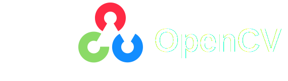

  
  

  
  
  <h1>Hi, I'm Rohit Chadda 👋</h1>
  
<strong>Full-Stack Developer | Building Interactive Systems & Intelligent Applications</strong> 
  NIT Allahabad • Batch 2027

  
  
  

---

### 🌟 About Me

I’m a passionate full-stack developer with a strong interest in building interactive and intelligent applications. From visual workflow automation platforms to computer vision solutions, I enjoy turning complex ideas into clean, functional products.

Currently pursuing my degree at NIT Allahabad, I focus on writing scalable code, understanding system design, and developing real-world applications rather than following surface-level tutorials.

> **"Code is not just about writing — it's about creating meaningful impact."**

---

<h2> Skills  </h2>

<h3>Languages</h3>

<h3> Frontend </h3>

<h3>Backend</h3>

<h3>Databases</h3>

<h3>Tools & Libraries</h3>

<!-- Ya yeh better: -->

---

### 🔥 Featured Projects

**🌟 NodeBase (AutomateIt) — Visual Workflow Automation Platform**  
A modern node-based platform that allows users to drag and drop nodes on an interactive canvas, connect logic flows, set triggers, and execute complex automated workflows.  

**My Contributions**: Implemented tRPC for type-safe APIs, integrated Sentry for monitoring, developed React Flow canvas interactions, added Inngest background job triggers, and worked on Polar integrations. This project significantly strengthened my understanding of complex frontend architecture and developer tooling.

**🐍 CobraKai — Intelligent Image Puzzle Solver**  
An end-to-end computer vision application that accepts puzzle images from a Django frontend, processes them using OpenCV (thresholding & preprocessing), extracts text using Tesseract OCR, and solves the puzzle automatically with a Python solver trained on Kaggle datasets.

**🏨 Abook — Room Booking System**  
Full-featured accommodation booking platform with search, availability management, and reservation system.

**📚 StudyBud**  
Collaborative study platform built with Django, designed to help students connect, share resources, and manage study groups.

**🛒 MyCart — Django E-Commerce Platform**  
Complete online shopping application featuring product catalog, review blog, cart functionality, and order tracking system.

**[View All Repositories →](https://github.com/rohit-chadda1803?tab=repositories)**

---

### 🏆 Journey & Milestones

- Actively contributed to group projects using modern tools like tRPC, React Flow, and Inngest  
- Developed multiple full-stack applications from scratch  
- Exploring Computer Vision and Workflow Automation  
- Regular DSA practice and system design learning

---

### 🚀 Future Goals

- Build and ship my own production-grade Visual Workflow tool  
- Create more advanced Computer Vision applications  
- Deepen expertise in System Design and scalable architectures  
- Make meaningful open-source contributions

---

### 📬 Let's Connect

- **Email**: rohitchadda129@gmail.com  
- **LinkedIn**: [Rohit Chadda](https://www.linkedin.com/in/rohit-chadda-0b4a03335/)  
- **Instagram**: [@rohitchadda1803](https://www.instagram.com/rohitchadda1803/)

---

  
  
<strong>Thank you for visiting! ✨</strong> 
  Feel free to explore my projects and reach out if you'd like to connect or collaborate.

